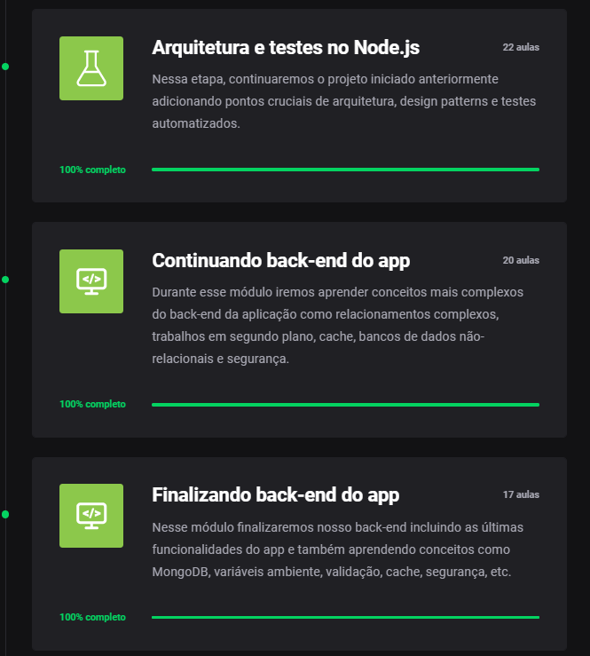
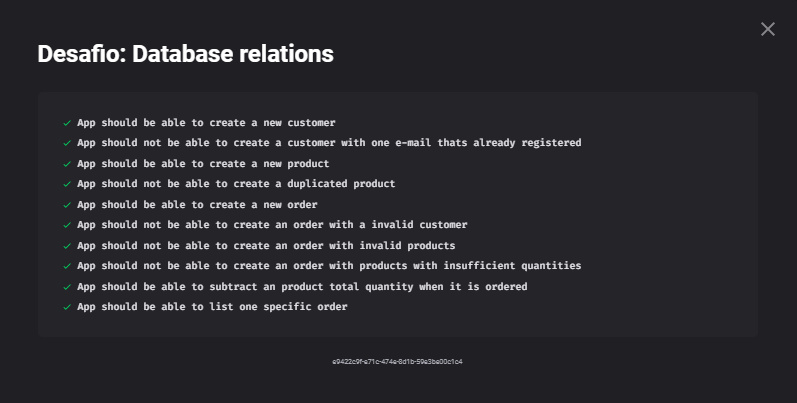

<h2 align="center">
  Desafio 09: Relacionamentos com banco de dados no Node.js
</h2>

<blockquote align="center">“Mude você e todo o resto mudará naturalmente”!</blockquote>

## Sobre o módulo 💪
Esse módulo foi realmente muito completo, foi abortados muitos assuntos fantásticos, de começo, foi nos apresentado o DDD e TDD e adaptamos o projeto GoBarber 
para usar esses dois, usamos também injeção de dependencias, aprendemos como usar os bancos mongoDB e também o Redis para armazenamento de cache.  
Deixamos a API do GoBarber completinha, já usando o Amazon S3 para armazenamento de imagens e para envio de emails.  
E para finalizar o módulo, tivemos o desafio onde colocamos em prática tudo que aprendemos no módulo. 😁  
</img> 
Para mais detalhes sobre o desafio e que era precisa ser feito para ser passado em cada teste, você pode ver neste <a href="https://github.com/rocketseat-education/bootcamp-gostack-desafios/tree/master/desafio-database-relations">link</a>.

## 10/10 Testes Concluídos 🎯
Foi usado o Jest (uma estrutura de testes criada pelo Facebook) para realizar os testes e ver se passamos no desafio, os testes eram os seguintes 🛠  
</img>
